# ⚙ Govner

A collection of Go development tools.

## Tools

### [gowt](./gowt/) - Go Test Watcher TUI


Terminal UI for running and viewing Go test results in real-time.

```bash
go install github.com/rickchristie/govner/gowt@latest
```

Make sure `$GOPATH/bin` is in your `PATH`. Add this to your `~/.bashrc`, `~/.zshrc`, or `~/.profile`:

```bash
export PATH="$PATH:$(go env GOPATH)/bin"
```

---

### [pgflock](./pgflock/) - PostgreSQL Test Database Pool


Spawn, lock, and control memory-backed PostgreSQL databases for testing backend code. Features a beautiful TUI for monitoring database usage in real-time.

```bash
go install github.com/rickchristie/govner/pgflock@latest
```

---

### [sandb](./sandb/) - AI Sandbox

```mermaid
flowchart LR
    project["📁 Your<br/>Project"]

    subgraph container["🐳 Sandboxed Container"]
        ai["🤖 AI Assistants<br/><small>Claude Code · Copilot CLI</small>"]
    end

    proxy["🛡️ Squid Proxy<br/><small>Domain Whitelist</small>"]

    allowed["✅ anthropic.com<br/>github.com<br/>npmjs.org"]
    blocked["🚫 All Other<br/>Domains"]

    project -.->|"mount"| ai
    ai -->|"all traffic"| proxy
    proxy --> allowed
    proxy -.-> blocked
```



Drop-in Docker sandbox for AI coding assistants with network isolation and domain whitelisting.

Supports Claude Code, GitHub Copilot CLI, and other CLI-based AI assistants. All network traffic is routed through a Squid proxy that only allows whitelisted domains (AI APIs, GitHub, npm).

```bash
# Run from your project directory
curl -sL https://github.com/rickchristie/govner/archive/refs/heads/main.tar.gz | tar -xz --strip-components=1 govner-main/sandb
sandb/install.sh
sandb/cli/build.sh
sandb/proxy/start.sh
sandb/shell.sh
```
