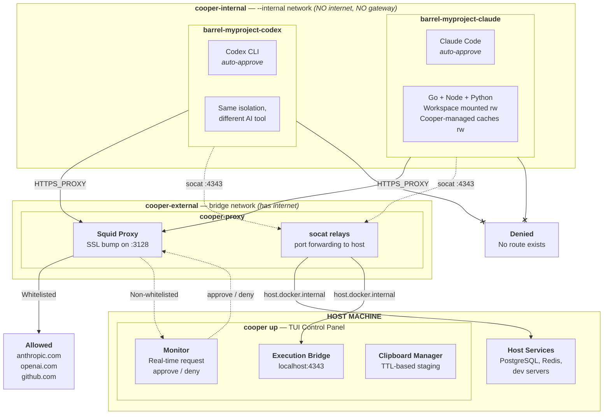

# Cooper

### Barrel-proof containers for undiluted AI

Run AI coding assistants in network-isolated Docker containers where every outbound request is visible, controllable, and reversible -- from a real-time TUI.

## Why Cooper?

AI coding assistants need broad system access to be useful -- but that access is a liability. They can be prompt-injected into exfiltrating code through package registries, downloading malicious dependencies, or making unexpected network requests. Cooper solves this by running each AI tool in its own Docker container on a network that **physically cannot reach the internet**, with a Squid SSL-bump proxy as the only exit and a TUI control panel where you approve every non-whitelisted request in real time.

**What you get:**

- **No internet escape** -- Containers run on a Docker `--internal` network with no gateway. Even raw sockets and `curl --noproxy '*'` can't get out. The [Security Model](#security-model) enforces this at the Linux networking layer -- there is simply no route.
- **See every HTTPS request** -- SSL bump decrypts TLS traffic so the [Proxy Monitor](#tui-control-panel) shows complete URLs, methods, and headers -- not just domain names.
- **Approve requests in real time** -- Non-whitelisted requests appear in the [TUI Control Panel](#tui-control-panel) with a countdown timer. Approve, deny, or let them timeout. One request at a time, no "always allow".
- **Access local host ports** -- Forward PostgreSQL, Redis, dev servers, or any host service into barrels through [Port Forwarding](#port-forwarding). Uses a two-hop socat relay so containers reach host services without any internet access.
- **Run scripts on host** -- Let AI tools trigger deploy, restart, or test scripts through the [Execution Bridge](#execution-bridge) -- a controlled HTTP API that returns stdout/stderr without giving shell access to your machine.
- **Copy-paste images** -- Paste screenshots and images into AI tools running inside containers with the [Clipboard Bridge](#clipboard-bridge). Press `c` in the TUI to stage your clipboard -- AI tools inside barrels see it as a normal paste. Time-limited, per-barrel authenticated.
- **Run headed browsers** -- Built-in Xvfb virtual display, Chromium dependencies, host font sync, and shared memory configuration for [Playwright](#playwright-support) testing inside barrels -- headed mode works out of the box.
- **Multi-tool, multi-workspace** -- Each AI tool gets its own [container image](#configuration). Open multiple barrels across different project directories, all monitored from one TUI.

## Supported AI Tools

| Tool | Command | Auto-approve flag |
|------|---------|-------------------|
| **Claude Code** | `cooper cli claude` | `--dangerously-skip-permissions` |
| **GitHub Copilot CLI** | `cooper cli copilot` | `--allow-all-tools` |
| **OpenAI Codex CLI** | `cooper cli codex` | `--dangerously-bypass-approvals-and-sandbox` |
| **OpenCode** | `cooper cli opencode` | `--auto-approve` |

Auto-approve flags are safe because the container is already sandboxed -- Cooper's network isolation, seccomp profile, and capability restrictions replace each tool's built-in permission system.

Custom tools can be added by placing a Dockerfile in `~/.cooper/cli/{tool-name}/`.

## Supported Platforms

- **Linux**: Any distro with Docker Engine 20.10+ and bash or zsh.
- **macOS (Apple Silicon)**: Docker Desktop 4.x+. Requires macOS 12+.
- **macOS (Intel)**: Docker Desktop 4.x+. Untested but expected to work.
- **Windows**: Not supported.

## How It Works

Cooper uses a **dual-network architecture** to enforce true network isolation at the Linux networking layer:



**Key insight:** The `cooper-internal` network is created with Docker's `--internal` flag -- it has **no default gateway and no route to any external network**. Containers on this network can only reach each other via Docker DNS. Even if an AI tool ignores proxy environment variables, opens raw sockets, or runs `curl --noproxy '*'`, it cannot reach the internet. There is simply no route.

The proxy container sits on **both** networks -- it receives traffic from barrels on the internal network and forwards whitelisted requests to the internet via the external network. Non-whitelisted requests are held pending in the TUI for your real-time approval.

## Quick Start

### Prerequisites

- **Linux**: Docker Engine 20.10+
- **macOS**: Docker Desktop 4.x+ (Docker Engine runs inside a Linux VM)
- **Go 1.21+** (for installation via `go install`)
- bash or zsh

### Install

```bash
go install github.com/rickchristie/govner/cooper@latest
```

Make sure Go's bin directory is in your `PATH`. If `cooper` isn't found after install, add this to your `~/.bashrc` or `~/.zshrc`:

```bash
export PATH="$PATH:$(go env GOPATH)/bin"
```

### Setup

```bash
# 1. Interactive configuration wizard
#    Sets up programming tools, AI tools, proxy whitelist, port forwarding
cooper configure

# 2. Build container images (proxy + base + per-tool CLI images)
cooper build

# 3. Start the control panel TUI (must be running before using barrels)
cooper up

# 4. Open a barrel (from your project directory)
cooper cli claude
```

### Day-to-day usage

```bash
# Start the control panel (once per session)
cooper up

# Open barrels from any project directory
cd ~/myproject && cooper cli claude
cd ~/other-project && cooper cli codex

# Update tool versions (mirrors host or fetches latest, based on your config)
cooper update

# Verify the full stack works end-to-end
cooper proof
```

## Commands

| Command | Description |
|---------|-------------|
| `cooper configure` | Interactive TUI wizard -- programming tools, AI tools, whitelist, ports, bridge |
| `cooper build` | Build proxy and all CLI container images. `--clean` for no-cache rebuild |
| `cooper up` | Start proxy, bridge, and TUI control panel. Must be running for barrels to work |
| `cooper update` | Regenerate Dockerfiles and rebuild only images with desired-vs-built drift, including implicit tools and base runtime changes |
| `cooper cli <tool>` | Launch a barrel. `-c "cmd"` for one-shot execution. `list` to show available tools |
| `cooper proof` | Full lifecycle integration test -- preflight through AI smoke test, then teardown |
| `cooper cleanup` | Remove all containers, images, and networks. Optionally remove `~/.cooper` |

## TUI Control Panel

The control panel (`cooper up`) is the nerve center. It has these tabs:

| Tab | What it does |
|-----|-------------|
| **Containers** | Live CPU/memory stats for all barrels and proxy. Stop/restart containers |
| **Monitor** | Real-time pending requests to non-whitelisted domains. Approve/deny with countdown |
| **Blocked** | History of denied requests with full details |
| **Allowed** | History of approved requests with response status codes and headers |
| **Bridge Logs** | Execution bridge invocations -- route, script, status, duration, stdout/stderr |
| **Ports** | Port forwarding rules. Add/edit/delete live (applied via SIGHUP, no restart) |
| **Routes** | Execution bridge mappings (API path to host script). Add/edit/delete at runtime |
| **Runtime** | Monitor timeout, history limits, clipboard TTL/size. Changes take effect immediately |
| **About** | Version info, installed tool versions vs host versions, implicit language servers, startup warnings |

**Clipboard bar** is always visible at the top -- press `c` to copy an image from your host clipboard so AI tools can paste it, `x` to clear.

## Configuration

All configuration lives in `~/.cooper/`. Run `cooper configure` to change settings through the interactive wizard.

### Programming Tools

Cooper detects Go, Node.js (npm/yarn/bun), and Python (pip/pipenv/poetry) on your host and offers three version modes:

| Mode | Behavior | When to use |
|------|----------|-------------|
| **Mirror** | Matches your host machine version | Keep container in sync with local dev |
| **Latest** | Fetches latest stable from upstream APIs | Always stay current |
| **Pin** | Exact version you specify | Reproducible builds |

Built-in programming tools also install Cooper-managed standard language-server tooling, versioned from the selected runtime:

- Go -> `gopls`
- Node.js -> `typescript-language-server` and `typescript`
- Python -> `pyright` and `python-lsp-server`

These are implicit defaults attached to the language tool, not separate top-level programming tools. TypeScript remains bundled under Node.js.

`~/.cooper/config.json` stores both desired configuration and built state. That built state includes top-level `container_version` values, resolved `implicit_tools`, and the built base Node runtime (`base_node_version`). `cooper update` and startup/About warnings compare those built values against the current desired state.

`cooper configure` save-only is allowed to reuse last-built implicit tool versions only when the relevant built runtime still matches the current desired runtime. If Cooper cannot prove that match, it fails instead of generating misleading Dockerfiles.

Run `cooper update` to apply Mirror/Latest changes after host upgrades.
When built language-server versions or the effective base Node runtime drift from the current desired versions, startup warnings and the About tab surface that mismatch before you open barrels.

### AI Tools

Same three version modes (Mirror/Latest/Pin) for each AI tool. Each enabled tool gets its own Docker image (`cooper-cli-{tool}`) built on top of `cooper-base`.

### Custom Tools

Place a Dockerfile in `~/.cooper/cli/{name}/` using `FROM cooper-base`. Cooper builds it as `cooper-cli-{name}` and never overwrites user-created directories. Launch with `cooper cli {name}`.

### Domain Whitelist

All traffic is blocked by default except:
- AI provider API domains for enabled tools (anthropic.com, openai.com, etc.)
- `raw.githubusercontent.com` (read-only, safe)

Package registries (npm, PyPI, Go proxy, crates.io) are **blocked by default** to prevent supply-chain attacks where an AI could be tricked into downloading malicious packages or exfiltrating data through registry requests. You can whitelist specific registries if needed, or approve individual requests through the TUI monitor.

Add trusted domains through `cooper configure` (company APIs, staging servers, metrics dashboards). For everything else, approve requests one at a time through the TUI monitor.

### Port Forwarding

Forward host service ports into barrels (e.g., PostgreSQL, Redis, dev servers). Uses a two-hop socat relay: barrel -> proxy -> host.

**Note (Linux):** Host services must bind to `0.0.0.0` or the Docker gateway IP to be reachable from containers. Services bound to `127.0.0.1` are handled by Cooper's HostRelay, which transparently proxies connections from the gateway IP to localhost.

**Note (macOS):** Docker Desktop handles host access natively. Services on any bind address, including `127.0.0.1`, are reachable from containers via `host.docker.internal`. No HostRelay is needed.

### Execution Bridge

Map API routes to host scripts so AI tools can trigger actions without shell access:

```
/deploy-staging  ->  ~/scripts/deploy-staging.sh
/restart-dev     ->  ~/scripts/restart-dev.sh
/go-mod-tidy     ->  ~/scripts/go-mod-tidy.sh
```

Scripts should take no input and handle concurrency. Stdout/stderr is returned in the HTTP response.

### Clipboard Bridge

Press `c` in the TUI to capture an image from your host clipboard. AI tools inside barrels see it as a normal paste -- no special commands needed.

- **User-initiated** -- your clipboard is never passively exposed. You choose when to share.
- **Time-limited** -- staged images expire after a configurable TTL (default 5 minutes).
- **Per-barrel authenticated** -- each barrel gets a unique cryptographic token. No cross-barrel access.
- **Format support** -- PNG, JPEG, GIF, BMP, TIFF, WebP, SVG (via ImageMagick). All converted to PNG.

Works transparently with every supported AI tool. Claude Code and OpenCode use shim scripts that intercept clipboard helper calls. Codex and Copilot use an X11 bridge that owns the virtual display clipboard. Custom tools get both strategies.

Configure TTL and max image size in the TUI Runtime Settings tab.

### Playwright Support

Every barrel comes with the runtime environment Playwright needs for headless browser testing:

- Chromium shared-library dependencies pre-installed
- Xvfb virtual display (1920x1080) with authenticated X11
- Baseline font set (DejaVu, Roboto, Noto, Noto CJK, Liberation, Noto Color Emoji)
- Host fonts synced to `~/.cooper/fonts` (mounted read-only into barrels)
- Shared Playwright browser cache (`~/.cooper/cache/ms-playwright`, mounted read-write)
- Configurable shared memory (`barrel_shm_size`, default `1g`) -- Docker's default 64m is too small for browsers

Cooper does **not** install Playwright itself or download browsers. Your project provides `npm install playwright` and `playwright install`. When Playwright downloads browsers, the requests appear in the TUI monitor for approval.

## Volume Mounts

| Host Path | Container Path | Mode | Purpose |
|-----------|---------------|------|---------|
| Current directory | Same path | read-write | Workspace |
| `.git/hooks` | Same path | read-only | Prevent hook injection |
| `~/.claude`, `~/.claude.json` | `/home/user/...` | read-write | Claude Code auth/config |
| `~/.copilot` | `/home/user/.copilot` | read-write | Copilot auth/history |
| `~/.codex` | `/home/user/.codex` | read-write | Codex config |
| `~/.config/opencode`, `~/.local/share/opencode`, `~/.local/state/opencode`, `~/.opencode` | `/home/user/...` | read-write | OpenCode config, state, and install data |
| `~/.gitconfig` | `/home/user/.gitconfig` | read-only | Git identity |
| `~/.cooper/cache/go-mod` | `/home/user/go/pkg/mod` | read-write | Go module cache |
| `~/.cooper/cache/go-build` | `/home/user/.cache/go-build` | read-write | Go build cache |
| `~/.cooper/cache/npm` | `/home/user/.npm` | read-write | npm cache |
| `~/.cooper/cache/pip` | `/home/user/.cache/pip` | read-write | pip cache |
| `~/.cooper/tmp/{container}` | `/tmp` | read-write | Per-barrel temp directory |

Language caches are Cooper-managed under `~/.cooper/cache/`, auto-configured based on which programming tools are enabled. They start empty and fill naturally during normal package-manager usage. Each barrel gets its own host-backed `/tmp` directory, isolated per container to avoid collisions between barrels sharing a workspace. Cooper clears the entire `~/.cooper/tmp/` tree whenever `cooper up` starts and whenever it shuts down, so every control-plane session begins and ends with a pristine temp area.

## Security Model

| Layer | Mechanism |
|-------|-----------|
| **Network** | `--internal` Docker network -- no gateway, no route to internet |
| **Proxy** | Squid SSL bump with domain whitelist and real-time approval |
| **Capabilities** | `--cap-drop=ALL` -- all Linux capabilities dropped |
| **Privileges** | `--security-opt=no-new-privileges` |
| **Seccomp** | Custom profile allowing bubblewrap (for Codex) while restricting everything else |
| **Process** | `--init` for proper PID 1 signal handling |
| **CA** | Per-installation local CA for TLS interception, never shared |
| **Git hooks** | `.git/hooks` mounted read-only to prevent injection |
| **Dependencies** | Package registries blocked by default; caches Cooper-managed under `~/.cooper/cache/` |
| **Clipboard** | User-initiated, time-limited, per-barrel authenticated, fail-closed |

## Adding Dependencies

Package registries are blocked by default. To install dependencies inside a barrel, either whitelist the needed registries in `cooper configure` or approve individual requests through the TUI monitor.

```bash
# Inside a barrel (after whitelisting registries or approving via monitor):
go mod download          # cached in ~/.cooper/cache/go-mod
npm install              # cached in ~/.cooper/cache/npm
pip install -r req.txt   # cached in ~/.cooper/cache/pip
```

Caches persist across barrel runs under `~/.cooper/cache/`, so subsequent installs are fast.

## Troubleshooting

### Run the full diagnostic suite

```bash
cooper proof
```

This stands up the entire stack, tests SSL, proxy, tools, AI CLI connectivity, port forwarding, and bridge -- then tears everything down. Output is designed to be copy-pasted into a GitHub issue.

### Check logs

```bash
# Command logs
ls ~/.cooper/logs/

# Proxy logs (from running container)
docker logs cooper-proxy
```

### Rebuild everything

```bash
# Clean rebuild (no Docker cache)
cooper build --clean
```

### Remove everything

```bash
cooper cleanup
```

## License

MIT
