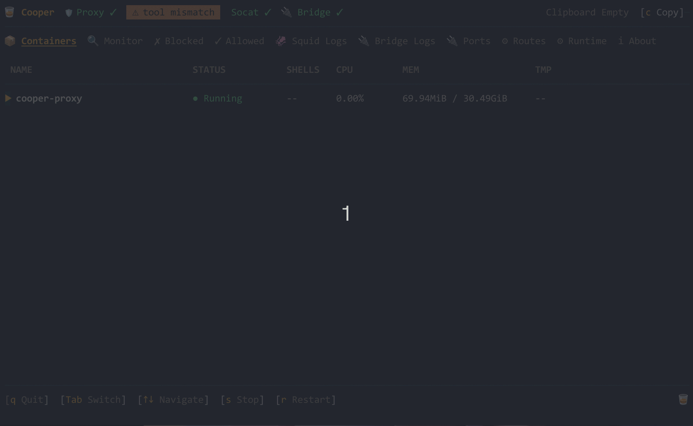

# Cooper

Run AI coding tools in Docker containers or KVM virtual machines. Cooper
controls outbound network access and shows pending requests in a terminal UI.



Use `cooper cli` for normal work. Use `cooper vm` when the work needs Docker
or a separate kernel. Both modes use the same workspace path, selected tool's
state, image versions, environment, clipboard, ports, and proxy rules.

## Quick start

You need Linux, Docker Engine 20.10 or later, bash or zsh, and Go 1.25 or later
to install. VM mode also needs an x86-64 host with KVM and nested KVM available.
macOS support is deprecated; profiles and VM mode are disabled there.
Windows hosts are not supported.

```sh
go install github.com/rickchristie/govner/cooper@latest
export PATH="$PATH:$(go env GOPATH)/bin"

cooper configure
cooper build
cooper up
```

Keep `cooper up` open. In another terminal, go to your project and start a tool:

```sh
cooper cli claude
# Or use a VM with its own Docker daemon:
cooper vm codex
```

Sign in with the tool on the host first. Cooper mounts its complete selected
state read-write, including login, sessions, settings, history, and memory.
Exit a conversation before you continue it in another environment. Keep the
same workspace path.

The first VM start prepares downloaded guest assets. Run `cooper vm prepare`
in advance to do this separately. Use `cooper vm doctor` to check the host and
runtime. From a source checkout, `./cooper/dev/setup.sh --check` checks host
requirements; `./cooper/dev/setup.sh` can set up KVM access.

## Tools and versions

| Cooper name | Host executable |
| --- | --- |
| `claude` | Claude Code: `claude` |
| `copilot` | GitHub Copilot CLI: `copilot` |
| `codex` | OpenAI Codex CLI: `codex` |
| `opencode` | OpenCode: `opencode` |
| `grok` | Grok Build: `grok` |
| `antigravity` | Antigravity CLI: `agy` (experimental) |
| `chatgpt` | ChatGPT desktop: `chatgpt` |

Select tools in `cooper configure`. Mirror uses the detected host version,
Latest resolves the upstream release, and Pin uses the version you specify.
Unavailable versions fail; Cooper does not silently replace a pin with Latest.
Run `cooper update` after host upgrades or version changes.

Go, Node.js, and Python are optional programming tools. Their standard language
servers are included: `gopls`, TypeScript with `typescript-language-server`,
and Pyright with `python-lsp-server`.

For a custom tool, put a Dockerfile based on `cooper-base` in
`~/.cooper/cli/<name>/`, build, then run `cooper cli <name>`.
Cooper does not overwrite custom directories. Built-in names are reserved;
rename a conflicting custom directory first.

### ChatGPT desktop

Select **ChatGPT (desktop)** in `cooper configure`, choose Mirror, Latest, or
Pin, then run `cooper build`. Build installs the official Linux package and
its desktop dependencies in a separate image. It does not install the app on
the host or include your login in the image.

With `cooper up` running, start from your project:

```sh
cooper vm chatgpt
```

Cooper opens a private local browser viewer with ChatGPT already running.
Use its **Terminal** button for a shell in the same workspace. You can also
type `chatgpt` in that terminal. Closing the viewer leaves the app and VM
running. Run the command again to reconnect; use Runtimes to stop it.
`cooper cli chatgpt` uses the same desktop in a Docker barrel when the host
permits the native app's user namespace sandbox.

The bundled engine starts with full access and no approval prompts inside
the workload. Existing tasks can retain their explicit permission settings;
select Full access in the app when needed. In VM mode this includes its own
Docker daemon. The workspace and selected state are writable. Cooper's proxy
and mount limits still apply.
Close any host app that uses the same desktop state before launch. Linux
keyring cookies require an unlocked host Secret Service. Named ChatGPT
account profiles cannot yet verify the desktop account identity. See
[desktop use, state, and verification](docs/desktop.md) for details.

### Grok

Run `grok login --oauth` on the host before launch. Cooper uses `GROK_HOME`
when it is not empty, or `~/.grok` otherwise. Set it in the environment from
which you start Cooper. The complete root and shared `~/.agents` are mounted.
Cooper does not override host Grok behavior settings or install a requirements
file. Its process socket is private to each runtime.

### Antigravity

Cooper supports the native terminal `agy`, not a desktop or editor extension.
On the physical Linux host, install `agy`, enable Antigravity in configure,
then run:

```sh
cooper build
. "$HOME/.local/share/cooper/antigravity/shell.sh"
agy
# Sign in, then exit agy before continuing elsewhere.
cooper cli antigravity
```

Build adds marked shell setup blocks for Bash and zsh. The wrapper selects file
authentication for `agy` only; it does not share, delete, or convert a host
keyring login. An existing keyring login needs a new file login. Build inside
Cooper cannot perform this physical-host setup.

The complete `~/.gemini` root is shared. It can also contain Gemini CLI and
desktop state. Stop those applications before a profile switch. Use
`agy --continue` or `agy --conversation=<id>` from the same workspace to
continue a session.

If launch prints `Please run cooper build and then run agy to relogin`,
complete those steps on the host. Explicit Gemini API mode needs both the
`modelProvider: gemini` setting and `GEMINI_API_KEY`. An API key alone does not
select that mode. Ordinary sessions can use ADC with `AGY_ADC_AUTH=true`;
named profiles do not support ADC, WIF, or external credential helpers.

## Account profiles

Profiles are Linux-only. They separate complete account state without an image
rebuild. Active state stays at its normal path. Inactive state uses a sibling,
such as `~/.opencode.cooper-<profile-id>`. Switching renames these directories;
it does not copy history or replace roots with symlinks.

Close the affected CLIs, apps, and Cooper runtimes, then:

```sh
cooper save codex           # Register the current account as Default in place.
cooper load codex Work      # Confirm Y to create and select empty Work state.
# Sign in with Codex on the host using the Work account, then exit it.
cooper save codex           # Bind Work to that account.
cooper load codex Default   # Confirm Y to return to Default.
```

Always load a new empty profile before changing accounts. Cooper refuses a
different account in an already bound profile. It cannot undo login changes
that an app has already written. Save checks the current binding and captures
supported credential variables; it has no destination-name argument and is
not a backup.

Names start with a letter and contain up to 40 letters, digits, underscores,
or hyphens. Lookup is case-insensitive. A missing load name creates a profile.
Keep CLI executables outside state roots; an executable in
`~/.opencode/bin` would disappear from the public path on a switch.

Every interactive switch asks you to stop affected applications and keep them
closed until completion. Enter means No; type `Y` to continue. Scripts need
`--yes` after stopping the same applications. Known open files, processes, or
runtime mounts block the operation even with `--yes`. Detection is incomplete:
an idle app, another namespace, or a new process can escape the check.

`~/.agents` remains shared by Codex and Grok. Profiles do not move, back up,
restore, or delete it. A profile is account separation, not protection from
other programs running as the same host user.

### Use a profile without switching the host

```sh
cooper cli codex Work
cooper vm codex Work
cooper profiles
```

Named sessions write directly to the selected profile. Without a name,
sessions use the current public host roots. An active named profile and a host
session therefore share the same data. Do not use one conversation concurrently.

Named sessions use the profile's saved credential environment, not another
account's host variables. For a host switch, Cooper cannot change your parent
shell: set or unset supported variables to match the incoming profile first.
A fresh profile requires them to be unset. File login is simpler for switching.

| Tool | Supported profile identity |
| --- | --- |
| Codex | ChatGPT account/workspace; supported default-provider OpenAI API auth |
| Claude | Linux OAuth account/organization; Anthropic API auth |
| Copilot | Explicit plaintext token login; supported token variables |
| OpenCode | Provider identities; API auth; OAuth with stable account IDs |
| Grok | Stored user/organization scope; supported API auth |
| Antigravity | Linux file OAuth; explicit Gemini API mode |

OS keyrings, unknown auth helpers, Codex custom providers, and opaque OAuth
records without stable IDs are not supported profile identities. Project
`.env` files and unknown provider variables are outside this guarantee.

### Backup and recovery

Close affected applications before a consistent backup:

```sh
cooper profiles backup /absolute/new-backup
cooper profiles restore codex Work /absolute/new-backup
cooper profiles recover
```

Backup makes an independent, verified copy of all registered profiles and
captured credentials. Its destination must not exist. Restore requires the
same registered profile ID and account, with its roots and parents intact.
It retains the replaced data in recovery siblings.

Use recover after an interrupted operation. It checks the journal and either
undoes the uncommitted switch or finishes the committed switch. If it reports
an unexpected path or entry, retain the data and journal for review. Do not
delete a journal to force launch.

`cooper profiles delete codex OldTest --yes` permanently removes an inactive,
unused profile. `cooper profiles prune-recovery --yes` permanently
removes retained recovery data and unused credential records. Make an
independent backup first. Ordinary runtime/cache cleanup preserves profiles.

Do not rename profile siblings by hand or separate them from
`~/.cooper/profiles` metadata. Use one store for a given set of roots.
Old 0.5.0/0.5.1 copy and symlink stores are rejected without changes. Build and
configure's Save & Build do not set up, move, or convert profiles.

## Network and host access

CLI containers use an internal Docker network. VMs have no network device;
guest processes and Docker use a restricted relay to Cooper's proxy. Neither
mode receives the host Docker socket.

The proxy permits configured destinations and asks about other eligible
requests. Static allowed domains keep end-to-end TLS; path rules and live
request review can require TLS inspection. Provider defaults are tool-specific.
`raw.githubusercontent.com` is also allowed by default; package registries
are not. An allowed host can still receive data. Treat every permanent or
session-wide permission as access to a destination, not proof of safe content.

Built-in launchers enable broad tool permissions inside the workload. Your
workspace, selected agent state, and caches remain writable. Cooper does not
protect those files from the agent. VM isolation also does not remove kernel,
hypervisor, resource-exhaustion, or approved-destination risks.

In configure or the live UI:

- Add persistent trusted domains only when needed.
- Forward only required host ports. Linux HostRelay can reach services bound
  to localhost. VMs can use only configured relay ports.
- Map bridge routes to fixed host scripts. Scripts must accept no untrusted
  input and handle concurrent calls. Their output returns to the workload;
  their host permissions are part of the access you grant.
- Set global Barrel Environment values for later sessions without a rebuild.
  They are plaintext in `config.json`, not a secret store. Proxy, path,
  terminal, authentication, and `COOPER_*` variables are protected.

Configuration is in `~/.cooper/config.json`. `--config <directory>` selects
another configuration directory; use the same directory for related commands.

## Control panel and clipboard

| Tab | Use |
| --- | --- |
| Runtimes | View resource use and health; stop or restart workloads |
| Monitor | Approve or deny pending requests |
| Profiles | Save, load, create, and delete account profiles |
| History | Review requests; `f` filters and Enter opens details |
| Squid Logs | Read recent proxy access logs |
| Bridge | Manage routes and inspect script output |
| Ports | Change forwarding rules live |
| Runtime | Change settings; inspect versions and warnings |

In Monitor, `w` allows the selected exact hostname for all workloads until
this `cooper up` exits. `s` opens the session list; `r` removes a selected
host. This does not change the permanent whitelist. Deny unnecessary background
requests; a prompt does not mean that the tool needs that host to answer.

Press `c` at the top level to stage a clipboard image and `x` to clear it.
A staged image expires after five minutes by default. Clipboard access is
authenticated per runtime. The tool sees a normal image paste. Change the
lifetime and size limit in Runtime settings.

In log views, click or drag to select lines, then press `y` to copy.
Shift+Up/Down extends the selection, Left/Right pans, and `G` follows new
output. Bridge Enter opens full execution output. These copy actions do not
grant the workload clipboard access. Use `[`/`]` or click to change panes.

The Runtime request-alert setting is off by default. If enabled but host audio
is unavailable, Cooper disables it and reports a warning.

## Commands and troubleshooting

| Command | Use |
| --- | --- |
| `cooper configure` | Edit settings; Save Only or Save & Build |
| `cooper build [--clean]` | Build images; `--clean` disables Docker build cache |
| `cooper update` | Refresh templates, reload proxy rules, and rebuild changed images |
| `cooper up` / `cooper down` | Start the control panel / stop runtime resources |
| `cooper cli list` | List available tool images |
| `cooper cli <tool> [-c "command"]` | Open a container or run one command |
| `cooper vm <tool> [-c "command"]` | Open a VM session or run one command |
| `cooper vm list` | List VM runtimes |
| `cooper vm stop <id>` / `cooper vm restart <id>` | Manage a VM |
| `cooper vm prepare` / `cooper vm doctor` | Prepare guest assets / diagnose VM state |
| `cooper proof` | Run integration diagnostics, including real agent requests |
| `cooper cleanup` | Remove runtime resources, images, and caches; optionally configuration |

`proof` can use provider credentials and account quota. Do not run it as a
credential-free unit test.

- Missing or old images: run `cooper build`. A changed host user, UID, GID,
  group, or home requires a rebuild; an AI account change does not.
- Blocked package or browser downloads: review the exact request in Monitor.
  Hostnames for downloads can differ from version metadata hosts.
- Missing Playwright: Cooper supplies Chromium libraries, Xvfb, fonts, shared
  memory, and a browser cache. Your project installs Playwright and browsers.
- Go cache requests despite an earlier download: a new version, missing
  checksum record, or Docker build layer can still need the network.
  Do not disable checksum checks to suppress a prompt.
- Unsafe state path: keep agent roots outside the Cooper directory and avoid
  whole-home mounts. Profiles also refuse root symlinks, mount points, replaced
  directories, and overlapping roots.
- A session is missing: use the same absolute workspace and state settings,
  and stop the first process before resuming.
- Build failure: retain the concrete error and log. In Save & Build, scrolling
  pauses log follow; End resumes it. Repeated network failures need a download
  check, not a new profile conversion.
- Logs: command logs and `access.log` are in `~/.cooper/logs/`;
  `docker logs cooper-proxy` shows the proxy container.

Implementation contracts and developer test commands are in
[TECHNICAL.md](TECHNICAL.md). License: MIT.
