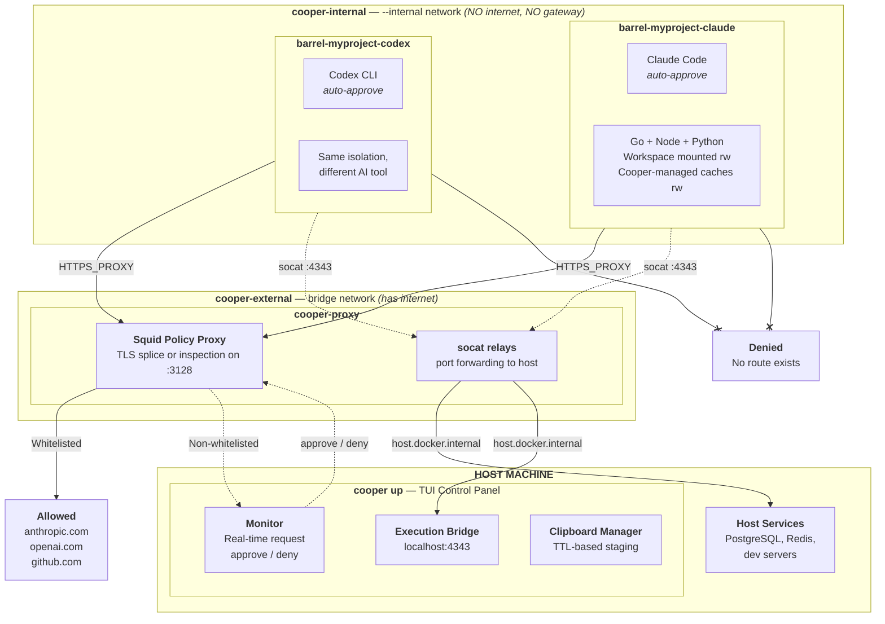

# Cooper

### Barrel-proof containers for undiluted AI

Run AI coding assistants in network-isolated containers or virtual machines. Control outbound access and runtime lifecycle from a real-time TUI.

## Why Cooper?

AI coding assistants need broad system access to be useful -- but that access is a liability. They can be prompt-injected into exfiltrating code through package registries, downloading malicious dependencies, or making unexpected network requests. Cooper solves this by running each AI tool in an isolated workload that **physically cannot reach the internet directly**, with a Squid policy proxy as the only exit and a TUI control panel where you approve every non-whitelisted request in real time.

**What you get:**

- **No internet escape** -- CLI barrels run on a Docker `--internal` network with no external route. VMs have no network device. Even raw sockets and `curl --noproxy '*'` can't get out. The [Security Model](#security-model) enforces this at the Linux networking layer -- there is simply no route.
- **See and control every HTTPS destination** -- Squid checks each destination. Cooper inspects full request details when a path rule or live approval requires TLS inspection. Static allowed domains keep end-to-end TLS.
- **Approve requests in real time** -- Non-whitelisted requests appear in the [TUI Control Panel](#tui-control-panel) with a countdown timer and a short host-side alert phrase. Approve or deny once, or explicitly allow one exact hostname until the current `cooper up` exits.
- **Access local host ports** -- Forward PostgreSQL, Redis, dev servers, or any host service into CLI and VM workloads through [Port Forwarding](#port-forwarding). Cooper exposes only the configured ports.
- **Run scripts on host** -- Let AI tools trigger deploy, restart, or test scripts through the [Execution Bridge](#execution-bridge) -- a controlled HTTP API that returns stdout/stderr without giving shell access to your machine.
- **Copy-paste images** -- Paste screenshots and images into AI tools with the [Clipboard Bridge](#clipboard-bridge). Press `c` in the TUI to stage your clipboard. AI tools in CLI and VM workloads see it as a normal paste. Access is time-limited and authenticated for each workload.
- **Run headed browsers** -- Built-in Xvfb virtual display, Chromium dependencies, host font sync, and shared memory configuration support [Playwright](#playwright-support) testing in CLI and VM workloads.
- **Develop Docker projects in a VM** -- `cooper vm` gives the agent its own Docker daemon. The guest has no network device, and all guest and nested-container traffic must use the same Cooper proxy policy.
- **Multi-tool, multi-workspace** -- Each AI tool gets its own [container image](#configuration). Open multiple CLI and VM workloads across different project directories. Monitor all of them from one TUI.

## Account profiles

Save and switch personal, work, and test accounts without rebuilding images.
Profiles keep the selected harness's complete state roots and the same absolute
paths in Docker and VM sessions. On Linux, `cooper build` sets up live
directory profiles automatically for fast account switches.

```bash
cooper save codex              # First save is Default.
cooper load codex Work         # Save the current account; create fresh Work state.
# Log in to Work with Codex on the host, then exit it.
cooper save codex              # Bind and save Work.
cooper cli codex Work          # Use the writable saved profile.
cooper vm codex Work           # Use the same profile in a VM.
cooper load codex Default      # Save Work and restore Default on the host.
```

Close the host harness and stop related runtimes before save/load. Without a
profile argument, `cooper cli` and `cooper vm` still mount live host state.
Save selects the account by its local identity, so it cannot accept the wrong
existing profile name as a destination. Manage profiles in the new Profiles
tab or with `cooper profiles`. See [Account profiles](docs/profiles.md) for
supported logins, credential environment, conflicts, and recovery.

```bash
cooper build
```

Build includes a required `Setting up live profiles...` step. It converts
existing saved profiles once and retains original state for recovery. Close
agents and related Cooper sessions before that first conversion. Later builds
check the live store without copying history. Save checks live state; it is not
a backup. See
[live profiles](docs/managed-profiles.md) for backup, restore, detach, and
supported layouts.

## Supported AI Tools

| Tool | Commands | Auto-approve flag |
|------|---------|-------------------|
| **Claude Code** | `cooper cli claude`, `cooper vm claude` | `--dangerously-skip-permissions` |
| **GitHub Copilot CLI** | `cooper cli copilot`, `cooper vm copilot` | `--allow-all-tools` |
| **OpenAI Codex CLI** | `cooper cli codex`, `cooper vm codex` | `--dangerously-bypass-approvals-and-sandbox` |
| **OpenCode** | `cooper cli opencode`, `cooper vm opencode` | None |
| **Grok Build** | `cooper cli grok`, `cooper vm grok` | `--always-approve` |
| **Antigravity CLI (experimental)** | `cooper cli antigravity`, `cooper vm antigravity` | `--dangerously-skip-permissions` |

The listed auto-approve flags are safe because Cooper isolates the workload before it starts the agent -- Cooper's network policy and runtime isolation replace each tool's built-in permission system.

Custom tools can be added by placing a Dockerfile in `~/.cooper/cli/{tool-name}/`. The name `grok` is reserved for built-in Grok Build. If you already have a custom `~/.cooper/cli/grok` directory, rename it and update any `cooper cli` invocation before configuring Grok.

### Antigravity CLI

Antigravity remains experimental. On Linux, `cooper build` sets up a host `agy`
wrapper for file authentication. Activate its printed shell setup, sign in on the host,
then use the mounted state or saved profiles in Docker and VM sessions.
Cooper does not share the host keyring. See the native guide below for setup,
token refresh, shell integration, and platform limits.

Antigravity uses the native `agy` executable and the complete host `~/.gemini` state root at the same path. Named profiles use that same root catalog. The reviewed release is 1.2.2. See [Antigravity CLI](docs/antigravity.md) for version pins, the image-owned browser driver, ADC paths, supported profile logins, and keyring limits. The built-in name `antigravity` is reserved; rename a custom directory with that name before configuration.

### Grok Build

Grok is installed from xAI's native CLI release channel, not npm. Mirror, latest, and pin all resolve to an exact `grok-<version>-linux-<arch>` artifact that Cooper copies into `/opt/cooper/bin/grok`.

Sign in with Grok on the host before you start a Grok session:

```bash
grok login --oauth
```

Cooper mounts the complete host Grok state root read-write at the same absolute path. The source is `GROK_HOME` when that variable is not empty. Otherwise, the source is `~/.grok`. Cooper resolves this path when the session starts. The shared `~/.agents` root is also mounted. Other agents' private roots are not mounted for Grok foreign-session discovery.

The Grok state root and the Cooper configuration directory must not contain each other. Cooper checks the direct paths and the paths after existing symlinks are resolved. It refuses an overlap before it resets runtime data, mounts Grok state, or removes Cooper configuration. This rule prevents Cooper cleanup from deleting host-owned Grok auth or sessions.

One root mount includes `auth.json`, `config.toml`, managed config, requirements, sessions, conversation search indexes, history, memory, rules, skills, plugins, logs, locks, downloads, and future Grok state. Cooper does not keep a separate OAuth store or per-workload session store. A state file that Grok adds below this root is shared without a Cooper update.

The Grok leader socket is transient process transport, not durable state. Cooper sets `GROK_LEADER_SOCKET=/tmp/cooper-grok-leader.sock`. Grok uses this path for the socket and its paired lock. Each workload has a separate `/tmp` mount. Thus, a Grok process in Cooper cannot attach to a Grok leader process on the host or in another workload.

The workspace also has the same absolute path on the host and in the workload. Thus, Grok uses the same workspace session key in both places. Exit a Grok conversation before you resume it in the other environment. Grok lock files protect shared files, but they do not make one conversation safe to use from two terminals at the same time.

Cooper does not install a Grok requirements file and does not set behavior-related `GROK_*` variables. The state-root and leader-socket variables only map paths. Host Grok settings, including memory settings, apply in the workload. A host `XAI_API_KEY` is also forwarded when it is set. Cooper's network policy is separate from Grok settings. Default proxy hosts while Grok is enabled are exact `auth.x.ai` and `cli-chat-proxy.grok.com`. The inference host has a fixed path allowlist (`/v1/chat/completions`, `/v1/responses`, `/v1/messages`, `/v1/models`, `/v1/user`, `/v1/privacy/coding-data-retention`). Storage, traces, settings, and unknown paths are denied even after dynamic approval. A Grok feature that needs another host remains blocked until the user allows that host. All workloads share one proxy, so domains required by other agents, including GitHub for Copilot, remain reachable from a Grok workload.

Clipboard paste uses Cooper's X11 bridge.

### OpenCode

OpenCode is installed from the official GitHub Release tarball
`https://github.com/anomalyco/opencode/releases/download/v<version>/opencode-linux-<x64|arm64>.tar.gz`,
not from `https://opencode.ai/install`. That convenience URL only redirects to a moving install script
which then fetches the same artifact, and it rate-limits (HTTP 429) during Docker builds.
The binary is placed in `/opt/cooper/bin/opencode` so the runtime `~/.opencode` state mount cannot hide it.

## Supported Platforms

- **CLI mode on Linux**: A distribution with Docker Engine 20.10+ and bash or zsh.
- **CLI mode on macOS (Apple Silicon)**: Docker Desktop 4.x+ and macOS 12+.
- **CLI mode on macOS (Intel)**: Docker Desktop 4.x+. This mode is not tested.
- **VM mode**: Linux x86-64 with Docker Engine, KVM access, and nested KVM. Run `./cooper/dev/setup.sh --check` in a source checkout. VM mode does not support macOS at this time.
- **Windows**: Not supported.

## How It Works

Cooper uses a **dual-network architecture** to enforce true network isolation at the Linux networking layer:


```mermaid
flowchart TB
    subgraph host["<b>HOST MACHINE</b>"]
        direction TB

        subgraph tui["<b>cooper up</b> &mdash; TUI Control Panel"]
            direction LR
            monitor["<b>Monitor</b><br/>Real-time request<br/>approve / deny"]
            bridge_api["<b>Execution Bridge</b><br/>localhost:4343"]
            clipboard["<b>Clipboard Manager</b><br/>TTL-based staging"]
        end

        host_services["<b>Host Services</b><br/>PostgreSQL, Redis,<br/>dev servers"]
    end

    subgraph external["<b>cooper-external</b> &mdash; bridge network <i>(has internet)</i>"]
        subgraph proxy_box["<b>cooper-proxy</b>"]
            direction TB
            squid["<b>Squid Policy Proxy</b><br/>TLS splice or inspection on :3128"]
            socat_proxy["<b>socat relays</b><br/>port forwarding to host"]
        end
    end

    subgraph internal["<b>cooper-internal</b> &mdash; --internal network <i>(NO internet, NO gateway)</i>"]
        direction LR
        subgraph barrel1["<b>barrel-myproject-claude</b>"]
            claude["Claude Code<br/><i>auto-approve</i>"]
            tools1["Go + Node + Python<br/>Workspace mounted rw<br/>Cooper-managed caches rw"]
        end
        subgraph barrel2["<b>barrel-myproject-codex</b>"]
            codex["Codex CLI<br/><i>auto-approve</i>"]
            tools2["Same isolation,<br/>different AI tool"]
        end
    end

    allowed["<b>Allowed</b><br/>anthropic.com<br/>openai.com<br/>github.com"]
    denied["<b>Denied</b><br/>No route exists"]

    barrel1 -- "HTTPS_PROXY" --> squid
    barrel2 -- "HTTPS_PROXY" --> squid
    barrel1 -. "socat :4343" .-> socat_proxy
    barrel2 -. "socat :4343" .-> socat_proxy
    socat_proxy -- "host.docker.internal" --> host_services
    socat_proxy -- "host.docker.internal" --> bridge_api
    squid -- "Whitelisted" --> allowed
    squid -. "Non-whitelisted" .-> monitor
    monitor -. "approve / deny" .-> squid
    barrel1 --x denied
    barrel2 --x denied

```

**Key insight:** The `cooper-internal` network is created with Docker's `--internal` flag -- it has **no default gateway and no route to any external network**. Containers on this network can only reach each other via Docker DNS. Even if an AI tool ignores proxy environment variables, opens raw sockets, or runs `curl --noproxy '*'`, it cannot reach the internet. There is simply no route.

The proxy container sits on **both** networks -- it receives traffic from barrels on the internal network and forwards whitelisted requests to the internet via the external network. Non-whitelisted requests are held pending in the TUI for your real-time approval.

### VM Mode

Use `cooper vm <tool>` when an agent must run Docker or when you want a kernel boundary. Use `cooper cli <tool>` for most work because it starts faster and uses less memory. Both commands use the same workspace path, selected-agent state, tool image, environment, clipboard, port rules, and proxy policy.

The VM runs under KVM in an unprivileged, networkless supervisor container. QEMU starts with `-nic none`, so guest root cannot enable a missing network device. Cooper uses an embedded, checksum-locked `virtiofsd` 1.14.0 helper. It maps guest file operations to the invoking host user and cannot create root-owned host files. A small relay accepts only proxy, bridge, and configured port-forward services. The VM has its own Docker daemon. Cooper never mounts the physical-host Docker socket in the guest.

The traffic path is:

```text
guest or guest container -> VM relay -> Cooper Squid proxy -> approved host
```

The first VM start downloads pinned Ubuntu and Docker assets and prepares an immutable guest base. Run `cooper vm prepare` in advance if you do not want this work during the first session. Later sessions use a small qcow2 overlay and reuse a healthy VM for the same workspace and agent.

VM mode checks that the selected agent image has the current VM runtime contract. If an image was built by an older Cooper release, `cooper vm` stops before guest startup and tells you to run `cooper build`.

Cooper supports one nested VM for self-development. A depth-1 VM has `/dev/kvm`; a managed depth-2 VM does not. Thus, an agent can build Cooper, run its Docker tests, and test `cooper vm` from inside `cooper vm`. See [VM security](docs/vm-security.md) for the boundary and remaining risks.

## Quick Start

### Prerequisites

- **Linux**: Docker Engine 20.10+
- **macOS**: Docker Desktop 4.x+ (Docker Engine runs inside a Linux VM)
- **Go 1.25+** (for installation via `go install`)
- bash or zsh

### Install

```bash
go install github.com/rickchristie/govner/cooper@latest
```

Make sure Go's bin directory is in your `PATH`. If `cooper` isn't found after install, add this to your `~/.bashrc` or `~/.zshrc`:

```bash
export PATH="$PATH:$(go env GOPATH)/bin"
```

### Setup

```bash
# 1. Interactive configuration wizard
#    Sets up programming tools, AI tools, proxy whitelist, port forwarding,
#    barrel environment variables
cooper configure

# 2. Build container images (proxy + base + per-tool CLI images)
cooper build

# 3. Start the control panel TUI (must be running before using Cooper workloads)
cooper up

# 4. Open a barrel (from your project directory)
cooper cli claude

# Optional: prepare and open a VM when the work needs Docker
# Source checkouts can first run ./cooper/dev/setup.sh --check.
cooper vm prepare
cooper vm codex
```

### Day-to-day usage

```bash
# Start the control panel (once per session)
cooper up

# Open barrels from any project directory
cd ~/myproject && cooper cli claude
cd ~/other-project && cooper cli codex

# Open a VM with its own Docker daemon
cd ~/docker-project && cooper vm codex

# Update tool versions (mirrors host or fetches latest, based on your config)
cooper update

# Verify the full stack works end-to-end
cooper proof
```

## Commands

| Command | Description |
|---------|-------------|
| `cooper configure` | Interactive TUI wizard -- programming tools, AI tools, whitelist, ports, barrel env, bridge |
| `cooper build` | Build proxy and all CLI container images. `--clean` for no-cache rebuild |
| `cooper up` | Start proxy, bridge, and TUI control panel. Must be running for CLI and VM sessions |
| `cooper update` | Regenerate templates, reload a running proxy, and rebuild only images with desired-vs-built drift |
| `cooper cli <tool>` | Launch a barrel. `-c "cmd"` for one-shot execution. `list` to show available tools |
| `cooper vm <tool>` | Launch or reuse a KVM workload with guest Docker. Supports `-c`, `list`, `stop`, `restart`, `doctor`, and `prepare` |
| `cooper proof` | Full lifecycle integration test -- preflight through AI smoke test, then teardown |
| `cooper cleanup` | Remove all workloads, images, networks, and VM caches. Optionally remove `~/.cooper` |

## TUI Control Panel

The control panel (`cooper up`) has these tabs:

| Tab | What it does |
|-----|-------------|
| **Runtimes** | Live CPU, memory, disk, and health data for the proxy, barrels, and VMs. Stop or restart workloads |
| **Monitor** | Real-time pending requests with countdown. Approve/deny once, or allow an exact hostname for this `cooper up` session |
| **Profiles** | Saved agent accounts and profile actions |
| **History** | Allowed and blocked requests in one list. Press `f` to filter and Enter for details |
| **Squid Logs** | The last 200 access log lines, followed by live output. Select and copy text |
| **Bridge** | Routes and execution logs in two panes. Edit host script mappings and inspect full output |
| **Ports** | Port forwarding rules. Add/edit/delete live (applied via SIGHUP, no restart) |
| **Runtime** | Settings and About in two panes: live settings, tool versions, and startup warnings |

In Monitor, `w` immediately allows the selected exact hostname for every
barrel until this `cooper up` exits. The session host count stays visible.
Press `s` to open the full list, then `r` to remove a host. This does not
save a permanent whitelist rule.

In Bridge and Runtime, click a pane or press `[` or `]` to move focus. Bridge
uses stacked panes in a narrow terminal. Runtime keeps Settings above About.
Each pane scrolls on its own.

Squid Logs opens at the latest records. At startup, Cooper reads only the
last 200 lines from the file, then follows new lines. The tab keeps a rolling
200-line history so old traffic cannot fill its event queue on entry. The
complete file remains in `~/.cooper/logs/access.log`.

In either log view, click a line or drag across lines, then press `y` to copy.
Arrow keys select lines; Shift+Up/Down extends the selection. Left/Right pans
long lines. Copy includes the full selected lines, including text outside
the pane. Selection pauses following; `G` resumes it. In Bridge, Enter opens
full execution output and `y` on a list row copies the complete record.
These copy actions write to the desktop clipboard. They do not grant a
workload access to the clipboard. Terminal-native selection is also available
with the terminal's mouse modifier, often Shift.

**Clipboard bar** is always visible at the top -- press `c` to copy an image from your host clipboard so AI tools can paste it, `x` to clear.

When a new request enters manual approval, Cooper can play one short host-side alert phrase. The Runtime tab includes a persisted checkbox for this, and it defaults to off so Cooper stays quiet unless you explicitly enable it. Linux uses PulseAudio or PipeWire's PulseAudio compatibility layer, macOS uses `afplay`, and if host audio is unavailable Cooper keeps running and disables the alert with a startup warning.

## Configuration

All configuration lives in `~/.cooper/`. Run `cooper configure` to change settings through the interactive wizard.

Every Cooper screen keeps its header and help footer fixed. The middle body owns
all remaining terminal rows and scrolls with the mouse wheel, arrow keys or
`j`/`k`, and Page Up/Page Down. On selectable lists, moving the selection also
keeps the selected row visible. Mouse reporting is enabled in both
`cooper configure` and `cooper up`; hold your terminal's selection modifier
(commonly Shift) when you want native text selection.

`Save & Build` has two explicit phases. Configuration validation, template
generation, ACL helper generation and CA staging finish on the preparation
screen at 100%. Cooper then switches to a dedicated Docker build screen that
streams combined Docker stdout/stderr. The log follows new output by default;
scrolling pauses follow mode and `End` resumes it. A failed build preserves its
logs and concrete error until dismissed.

### Programming Tools

Cooper detects Go, Node.js (npm/yarn/bun), and Python (pip/pipenv/poetry) on your host and offers three version modes:

| Mode | Behavior | When to use |
|------|----------|-------------|
| **Mirror** | Matches your host machine version | Keep container in sync with local dev |
| **Latest** | Fetches latest stable from upstream APIs | Always stay current |
| **Pin** | Exact version you specify | Reproducible builds |

Built-in programming tools also install Cooper-managed standard language-server tooling, versioned from the selected runtime:

- Go -> `gopls`
- Node.js -> `typescript-language-server` and `typescript`
- Python -> `pyright` and `python-lsp-server`

During the image build, Cooper installs `gopls` exclusively through the
official `proxy.golang.org` module service and `sum.golang.org` checksum
database. It does not trust a third-party module mirror and does not use
`GOPROXY=direct`, which would still depend on Google's vanity and source hosts.

Intermittent destination-specific routing failures can occur even while other
internet traffic remains healthy, so Cooper makes up to eight fresh install
attempts. Each attempt has a two-minute deadline and completed module-cache
downloads remain available to the next attempt. A five-second linear backoff
between attempts lets a failing edge or NAT path recover while keeping the
Docker layer's worst-case duration bounded.

The smaller official Go metadata requests use four bounded attempts with a
short linear backoff. Transport failures, HTTP 429, and server errors are
retried; HTTP 404 remains a definitive missing-version result. This covers both
latest-version resolution and the `go.dev` artifact check used to validate an
older pinned Go release before a build starts.

These are implicit defaults attached to the language tool, not separate top-level programming tools. TypeScript remains bundled under Node.js.

`~/.cooper/config.json` stores both desired configuration and built state. That built state includes top-level `container_version` values, resolved `implicit_tools`, and the built base Node runtime (`base_node_version`). `cooper update` and startup/About warnings compare those built values against the current desired state.

`cooper configure` save-only is allowed to reuse last-built implicit tool versions only when the relevant built runtime still matches the current desired runtime. If Cooper cannot prove that match, it fails instead of generating misleading Dockerfiles.

Run `cooper update` to apply Mirror/Latest changes after host upgrades.
When built language-server versions or the effective base Node runtime drift from the current desired versions, startup warnings and the About tab surface that mismatch before you open a CLI or VM workload.

Every `cooper update` also regenerates the volume-mounted proxy configuration. If Squid is running, Cooper reloads it even when no image needs a rebuild. This prevents save-only tool selection and whitelist changes from leaving Squid on an older authorization set.

### AI Tools

Same three version modes (Mirror/Latest/Pin) for each AI tool. Each enabled tool gets its own Docker image (`cooper-cli-{tool}`) built on top of `cooper-base`.

### Custom Tools

Place a Dockerfile in `~/.cooper/cli/{name}/` using `FROM cooper-base`. Cooper builds it as `cooper-cli-{name}` and never overwrites user-created directories. Launch with `cooper cli {name}`.

### Domain Whitelist

All traffic is blocked by default except:
- AI provider API domains for enabled tools (anthropic.com, openai.com, etc.)
- `raw.githubusercontent.com` (read-only, safe)

Package registries (npm, PyPI, Go proxy, crates.io) are **blocked by default** to prevent supply-chain attacks where an AI could be tricked into downloading malicious packages or exfiltrating data through registry requests. You can whitelist specific registries if needed, approve an individual request, or press `w` on a pending request to allow only that exact hostname until the current `cooper up` exits.

Persistent trusted domains still belong in `cooper configure` (company APIs, staging servers, metrics dashboards). Session access is held only in memory, applies to every workload attached to that Cooper proxy, remains visible and revocable under `s` in the Monitor tab, and is cleared without editing proxy settings when Cooper exits.

### Port Forwarding

Forward host service ports into barrels and VMs (e.g., PostgreSQL, Redis, dev servers). Cooper applies live rule changes to both execution modes. A VM can reach only the configured ports through its service relay.

**Note (Linux):** Host services must bind to `0.0.0.0` or the Docker gateway IP to be reachable from containers. Services bound to `127.0.0.1` are handled by Cooper's HostRelay, which transparently proxies connections from the gateway IP to localhost.

**Note (macOS):** Docker Desktop handles host access natively. Services on any bind address, including `127.0.0.1`, are reachable from containers via `host.docker.internal`. No HostRelay is needed.

### Barrel Environment

Use the `Barrel Environment` screen in `cooper configure` to define global env vars that are loaded into every later `cooper cli` and `cooper vm` session.

Example values:

```text
API_BASE_URL=https://internal.example.com
FEATURE_FLAG=1
EMPTY=
```

- Scope is global: the values live in `~/.cooper/config.json` and apply to all Cooper workloads, tools, and workspaces.
- Runtime-only: changes apply on the next `cooper cli` or `cooper vm` session. No `cooper build` is needed.
- Precedence is safe: Cooper loads user env first, then restores protected runtime env such as upper- and lower-case proxy values, `PATH`, `TZ`, `DISPLAY`, token env, terminal color/hyperlink policy and metadata env, IDE env, and `COOPER_*` names.
- Protected names cannot be configured, including `HTTP_PROXY`, `http_proxy`, `PATH`, `TZ`, `TERM`, `COLORTERM`, `NO_COLOR`, `FORCE_COLOR`, `OPENAI_API_KEY`, and any `COOPER_*` variable.
- Values are stored in plain text in `~/.cooper/config.json`. This is not a secret store.

### Execution Bridge

Map API routes to host scripts so AI tools can trigger actions without shell access:

```
/deploy-staging  ->  ~/scripts/deploy-staging.sh
/restart-dev     ->  ~/scripts/restart-dev.sh
/go-mod-tidy     ->  ~/scripts/go-mod-tidy.sh
```

Scripts should take no input and handle concurrency. Stdout/stderr is returned in the HTTP response.

### Clipboard Bridge

Press `c` in the TUI to capture an image from your host clipboard. AI tools inside barrels and VMs see it as a normal paste -- no special commands needed.

- **User-initiated** -- your clipboard is never passively exposed. You choose when to share.
- **Time-limited** -- staged images expire after a configurable TTL (default 5 minutes).
- **Per-runtime authenticated** -- each barrel or VM gets a unique cryptographic token. No cross-runtime access.
- **Format support** -- PNG, JPEG, GIF, BMP, TIFF, WebP, SVG (via ImageMagick). All converted to PNG.

Works transparently with every supported AI tool. Claude Code and OpenCode use shim scripts that intercept clipboard helper calls. Codex, Copilot, and Grok Build use an X11 bridge that owns the virtual display clipboard. Custom tools get both strategies.

Configure TTL and max image size in the TUI Runtime Settings tab.

### Playwright Support

Every barrel and VM agent container has the runtime environment that Playwright needs for headless browser testing:

- Chromium shared-library dependencies pre-installed
- Xvfb virtual display (1920x1080) with authenticated X11
- Baseline font set (DejaVu, Roboto, Noto, Noto CJK, Liberation, Noto Color Emoji)
- Host fonts synced to `~/.cooper/fonts` (mounted read-only into workloads)
- Shared Playwright browser cache (`~/.cooper/cache/ms-playwright`, mounted read-write)
- Configurable shared memory (`barrel_shm_size`, default `1g`) -- Docker's default 64m is too small for browsers

Cooper does **not** install Playwright itself or download browsers. Your project provides `npm install playwright` and `playwright install`. When Playwright downloads browsers, the requests appear in the TUI monitor for approval.

## Volume Mounts

CLI and VM mode use one shared mount policy. The VM supervisor can see only the approved mount sources that it must export with virtiofs. Inside the guest, the selected agent container receives the same targets as a CLI barrel.

Cooper builds the agent account with the host login name, primary group, UID, GID, and home path. For example, a host account `ricky` with home `/home/ricky` gets that same account and home in both modes. `HOME`, `USER`, `LOGNAME`, and the password database agree. The home path does not have to match the login name.

Run `cooper build` once after this upgrade. Launch rejects old images or images built for another account. Account changes require a rebuild; `cooper up` does not change image accounts. Agent state overrides are read at launch and do not require a rebuild.

| Host path | Workload path | Mode | Purpose |
|-----------|---------------|------|---------|
| Current directory | Same path | read-write | Workspace |
| `.git/hooks` | Same path | read-only | Prevent hook injection |
| `CLAUDE_CONFIG_DIR` or `~/.claude`, existing `~/.claude.json` | Same paths | read-write | Claude Code state |
| `COPILOT_HOME` or `~/.copilot` | Same path | read-write | Copilot state |
| Effective Copilot cache root | Same path | read-write | Copilot cache and helper downloads |
| `CODEX_HOME` or `~/.codex`, `~/.agents`, `~/.claude-plugin`, `~/.cursor-plugin` | Same paths | read-write | Codex state, shared skills, and marketplace roots |
| Effective XDG config, data, state, and cache roots with `/opencode` appended; `~/.opencode` | Same paths | read-write | OpenCode state |
| `OPENCODE_CONFIG_DIR`, existing `OPENCODE_CONFIG`, custom `OPENCODE_DB` directory | Same paths | read-write | Explicit OpenCode paths |
| `GROK_HOME` or `~/.grok`, `~/.agents` | Same paths | read-write | Complete Grok and shared agent state |
| `~/.gemini`; effective ADC credential parent when ADC is enabled | Same paths | read-write | Complete Antigravity and shared Google state; see [Antigravity](docs/antigravity.md) |
| Existing `~/.gitconfig` | Same path | read-only | Git identity |
| `~/.cooper/cache/go-mod` | `/go/pkg/mod` | read-write | Go module cache |
| `~/.cooper/cache/go-build` | `/var/lib/cooper/cache/go-build` | read-write | Go build cache |
| `~/.cooper/cache/npm` | `/var/lib/cooper/cache/npm` | read-write | npm cache |
| `~/.cooper/cache/pip` | `/var/lib/cooper/cache/pip` | read-write | pip cache |
| `~/.cooper/tmp/{runtime}` | `/tmp` | read-write | Temporary files for one workload |

Only the selected agent's state roots are mounted. Cooper does not mount the complete host home. A private runtime home holds shell defaults and temporary application files; selected state roots are mounted below it or at their configured absolute paths. Image binaries stay in `/opt/cooper/bin` and `/opt/cooper/npm`, where a host state mount cannot hide them.

New files below a selected root are shared automatically. To support an additional root, update the shared list in `internal/workload/agentpaths.go`. Both execution modes, session reuse checks, and cleanup checks use that list. See [Account and state paths](docs/home-paths.md) for path rules, the build boundary, and profile path rules.

Language caches are Cooper-managed under `~/.cooper/cache/`, auto-configured based on which programming tools are enabled. They start empty and fill naturally during normal package-manager use. Each workload gets its own host-backed `/tmp` directory. Cooper clears the complete `~/.cooper/tmp/` tree when `cooper up` starts and when it stops.

## Security Model

| Layer | Mechanism |
|-------|-----------|
| **CLI network** | `--internal` Docker network -- no external route |
| **Proxy** | Squid destination policy with selective TLS inspection and real-time approval |
| **Capabilities** | `--cap-drop=ALL` -- all Linux capabilities dropped |
| **Privileges** | `--security-opt=no-new-privileges` |
| **Seccomp** | Custom profile allowing bubblewrap (for Codex) while restricting everything else |
| **Process** | `--init` for proper PID 1 signal handling |
| **CA** | Per-installation CA for requests that require TLS inspection, never shared |
| **Git hooks** | `.git/hooks` mounted read-only to prevent injection |
| **Dependencies** | Package registries blocked by default; caches Cooper-managed under `~/.cooper/cache/` |
| **Clipboard** | User-initiated, time-limited, per-runtime authenticated, fail-closed |
| **VM network** | QEMU has no NIC; a service allow-map outside the guest controls all proxy, bridge, and forward traffic |
| **VM runtime** | An unprivileged, read-only supervisor has no Docker network and receives only `/dev/kvm` plus approved mount sources |
| **Guest Docker** | The socket gives root only in the guest; the physical-host Docker socket is never mounted |

## Adding Dependencies

Package registries are blocked by default. To install dependencies inside a barrel, VM, nested container, or Docker build, whitelist the needed registries in `cooper configure` or approve individual requests through the TUI monitor.

```bash
# Inside a barrel (after whitelisting registries or approving via monitor):
go mod download          # cached in ~/.cooper/cache/go-mod
npm install              # cached in ~/.cooper/cache/npm
pip install -r req.txt   # cached in ~/.cooper/cache/pip
```

Caches persist across workload runs under `~/.cooper/cache/`, so subsequent installs are fast.

Inside a VM, Docker pulls use the Cooper proxy automatically. Cooper also sends the proxy settings as predefined Docker build arguments. A Dockerfile does not have to declare `ARG HTTP_PROXY` or `ARG HTTPS_PROXY`.

## Troubleshooting

### Run the full diagnostic suite

```bash
cooper proof
```

This stands up the entire stack, tests SSL, proxy, tools, AI CLI connectivity, port forwarding, and bridge -- then tears everything down. Output is designed to be copy-pasted into a GitHub issue.

For VM-specific diagnostics, use:

```bash
cooper vm doctor
```

The report distinguishes an unsupported host, missing prepared assets, missing infrastructure images, no running VM, and an unhealthy running VM. For source development, start with `./cooper/test-vm-dev.sh unit`, then use a small prepared VM profile from [the development guide](dev/README.md). Run the complete `timeout 90m ./cooper/test-vm.sh` gate only before a release on the physical Linux host.

### Grok login, versions, or custom-directory collisions

- Missing or expired login: stop active Grok sessions and run `grok login --oauth` on the host. The next Grok session uses the updated shared `auth.json`.
- Unexpected state root: start Cooper from the same host environment as Grok. If you use `GROK_HOME`, make sure that it is set before a Grok session starts.
- Unsafe state root: move `GROK_HOME` outside the Cooper configuration directory. Neither path can contain the other, including through a symlink.
- A conversation is not available: use the same workspace path, and exit the first Grok process before you resume the conversation.
- A new Grok API path is blocked: Squid denies unknown `cli-chat-proxy.grok.com` paths with 403. That is fail-closed until Cooper reviews the path.
- Unsupported architecture: Grok images support Linux `amd64`/`x86_64` and `arm64`/`aarch64` only.
- `~/.cooper/cli/grok` already exists as a custom image: rename it. Cooper will not overwrite or ignore that directory.

### Check logs

```bash
# Command logs
ls ~/.cooper/logs/

# Proxy logs (from running container)
docker logs cooper-proxy
```

### Rebuild everything

```bash
# Clean rebuild (no Docker cache)
cooper build --clean
```

### Remove everything

```bash
cooper cleanup
```

## License

MIT
