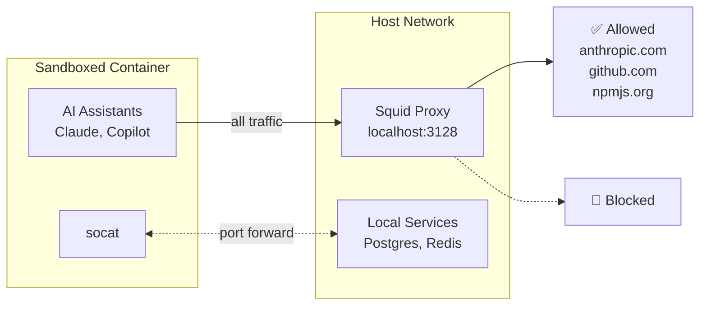

# AI Sandbox

**Drop-in Docker sandbox for AI coding assistants with network isolation and domain whitelisting.**



Download `sandb/` to any Go project to run AI coding assistants in a secure, isolated Docker environment where network access is restricted to only whitelisted domains.

> **Note:** The folder can be renamed (e.g., `sandb`, `_sandb`, `.ai-sandbox`). All scripts automatically detect the folder name.

## Why Use This?

- **Security**: AI assistants can only access whitelisted domains (AI APIs, GitHub, npm, Go proxy)
- **Isolation**: No direct internet access from the container
- **Convenience**: Auto-approve mode enabled (container is already sandboxed)
- **Go Development**: Pre-configured with Go runtime matching your host version
- **Portability**: Drop-in directory, works with any Go project

## Supported AI Assistants

| Assistant | Status | Notes |
|-----------|--------|-------|
| **Claude Code** | Supported | Native install with auto-updates. Uses `--dangerously-skip-permissions` (safe in sandbox). |
| **GitHub Copilot CLI** | Supported | Requires fine-grained PAT with "Copilot Requests" permission. Uses `--allow-all-tools`. |
| **Cursor** | Not supported | IDE-based, cannot run in container. |
| **Windsurf** | Not supported | IDE-based, cannot run in container. |
| **Aider** | Possible | Not pre-installed. Add to Dockerfile and whitelist required API domains. |
| **OpenAI Codex CLI** | Possible | Not pre-installed. Uncomment OpenAI domains in `proxy/squid.conf`. |

To add support for other CLI-based AI assistants:
1. Install the tool in `cli/Dockerfile`
2. Whitelist required domains in `proxy/squid.conf`
3. Rebuild with `sandb/cli/build.sh`

## Quick Start

### 1. Download to Your Project

```bash
# Run from your project directory
curl -sL https://github.com/rickchristie/govner/archive/refs/heads/main.tar.gz | tar -xz --strip-components=1 govner-main/sandb
```

### 2. Install and Build

```bash
# Install VS Code tasks + sync Go version (requires jq)
sandb/install.sh

# Build CLI image
sandb/cli/build.sh

# Start proxy (runs until stopped)
sandb/proxy/start.sh

# Get interactive shell
sandb/shell.sh
```

### 3. Use Inside Container

```bash
claude                    # Interactive Claude Code
claude "your prompt"      # One-shot mode
copilot -p "your prompt"  # GitHub Copilot CLI

go build ./...            # Build Go project
go test ./...             # Run tests
```

**Note:** `go get` and `go mod download` do NOT work inside the container (see [Go Modules](#go-modules) section).

## After Upgrading Go

When you upgrade Go on your host machine, sync the container:

```bash
# 1. Update Dockerfile with new Go version
sandb/install.sh

# 2. Rebuild CLI image
sandb/cli/build.sh
```

The `install.sh` script automatically detects your host's Go version and updates the Dockerfile.

## Updating Claude Code and Copilot CLI

Because the container runs behind a strict proxy, Claude Code and Copilot CLI cannot auto-update themselves. To update these tools, rebuild the CLI image:

```bash
sandb/cli/build.sh
```

Or use the VS Code task: **AI: Build CLI**

## Architecture

The sandbox uses two Docker containers with different network modes:

**Squid Proxy** runs on `--network=host`, sharing ports with your host machine. This allows the proxy to be accessible from both the CLI container and any other containers on your system at `localhost:3128`.

**CLI Container** runs on a bridge network with no direct internet access. All HTTP/HTTPS traffic is forced through the proxy via `HTTP_PROXY` environment variables. The container can access host services via `host.docker.internal` using socat port forwarding.

```
Host Machine
+-- Squid Proxy (--network=host, localhost:3128)
|   +-- Whitelists: anthropic, github, npm, golang
|   +-- All other domains blocked
|
+-- CLI Container (bridge network, sandboxed)
    +-- HTTP_PROXY -> host:3128
    +-- No direct internet access
    +-- socat -> host.docker.internal (for local services)
    +-- Go + Node.js + Claude Code + Copilot CLI
    +-- Workspace mounted at same path as host
```

## Directory Structure

```
sandb/
+-- cli/
|   +-- Dockerfile      # CLI container (Go + Node.js + AI tools)
|   +-- build.sh        # Build CLI image
|   +-- entrypoint.sh   # Container entrypoint (socat examples commented)
+-- proxy/
|   +-- Dockerfile      # Squid proxy container
|   +-- build.sh        # Build proxy image
|   +-- start.sh        # Start proxy container
|   +-- stop.sh         # Stop proxy container
|   +-- squid.conf      # Domain whitelist configuration
+-- shell.sh            # Open interactive shell in container
+-- start-cli.sh        # Start CLI container
+-- stop-cli.sh         # Stop CLI container
+-- doctor.sh           # Verify network isolation (run inside container)
+-- install.sh          # Sync Go version + install VS Code tasks
+-- README.md           # This file
```

## Customization Guide

### Adding Domain Whitelists

Edit `proxy/squid.conf` to allow additional domains:

```conf
# Your company's internal registry
acl allowed_domains dstdomain registry.yourcompany.com

# Python PyPI (if needed)
acl allowed_domains dstdomain pypi.org
acl allowed_domains dstdomain files.pythonhosted.org
```

### Port Forwarding to Host Services

If your AI assistant needs to access local services (e.g., PostgreSQL, Redis, or other databases running on your host), you can use socat to forward ports from the container to your host machine.

**Configuration file:** `cli/entrypoint.sh`

Edit the file and uncomment/modify the socat section:

```bash
run_socat() {
    local port=$1
    local name=$2
    while true; do
        socat TCP-LISTEN:${port},bind=127.0.0.1,fork,reuseaddr,backlog=5000 TCP:host.docker.internal:${port} 2>&1
        sleep 1
    done
}

run_socat 5432 "postgres" &
run_socat 6379 "redis" &
```

This allows code inside the container to connect to `localhost:5432`, which forwards to the host's PostgreSQL.

**After modifying socat settings, rebuild the CLI image:**

```bash
sandb/cli/build.sh
```

### Container Management from Proxy

To manage Docker containers from the proxy (e.g., for test database helpers):

1. Edit `proxy/Dockerfile`:
```dockerfile
RUN apk add --no-cache socat docker-cli nmap-ncat postgresql-client
COPY your-helper.sh /usr/local/bin/
RUN chmod +x /usr/local/bin/your-helper.sh
```

2. Edit `proxy/start.sh` to mount docker socket:
```bash
docker run -d \
    --name "${CONTAINER_NAME}" \
    --network host \
    --restart unless-stopped \
    -v /var/run/docker.sock:/var/run/docker.sock \
    "${IMAGE_NAME}"
```

## VS Code Tasks

After running `install.sh`, these tasks are available:

| Task | Script | Description |
|------|--------|-------------|
| AI: Build Proxy | `sandb/proxy/build.sh` | Build Squid proxy image |
| AI: Build CLI | `sandb/cli/build.sh` | Build CLI sandbox image |
| AI: Start Proxy | `sandb/proxy/start.sh` | Start Squid proxy container |
| AI: Stop Proxy | `sandb/proxy/stop.sh` | Stop Squid proxy container |
| AI: Stop CLI | `sandb/stop-cli.sh` | Stop CLI container |
| AI: Shell | `sandb/shell.sh` | Open interactive shell in container |
| AI: Doctor | `sandb/doctor.sh` | Verify network isolation and connectivity |

## Go Modules

**`go get` and `go mod download` do NOT work inside the container.** This is by design for security.

### Why?

`proxy.golang.org` redirects module downloads to `storage.googleapis.com`, which hosts arbitrary user content. Whitelisting this domain would enable data exfiltration.

### How It Works

1. Go module cache is mounted **read-only** from host (`~/go/pkg/mod`)
2. Go build cache is mounted from host (`~/.cache/go-build`)
3. `GOFLAGS=-mod=readonly` is set to enforce this

### Adding New Dependencies

When you need new Go dependencies:

```bash
# 1. Exit container (if inside)
exit

# 2. Download modules on HOST
go mod download

# 3. Re-enter container
sandb/shell.sh

# 4. Build/test as normal
go build ./...
```

## Network Whitelisting

Default allowed domains in `proxy/squid.conf`:

| Category | Domains |
|----------|---------|
| Claude/Anthropic | `*.anthropic.com`, `statsig.anthropic.com` |
| GitHub | `github.com`, `api.github.com` |
| GitHub Copilot | `copilot-proxy.githubusercontent.com`, `*.githubcopilot.com` |
| NPM | `registry.npmjs.org` |
| Telemetry | `collector.github.com`, `default.exp-tas.com` |

**All other domains are blocked.**

### Security Notes

These domains are intentionally NOT whitelisted:
- `proxy.golang.org` / `storage.googleapis.com` - Hosts arbitrary user content (data exfiltration risk). Use host's Go module cache instead.
- `*.sentry.io` - Allows any Sentry project (data exfiltration risk)

## Security Model

| Setting | Purpose |
|---------|---------|
| `--cap-drop=ALL` | Drop all Linux capabilities |
| `--security-opt=no-new-privileges` | Prevent privilege escalation |
| Bridge network | No direct host network access |
| Squid proxy | HTTP/HTTPS whitelist only |
| Read-only mounts | Git hooks, caches mounted read-only |

## Parallel Workspace Support

Each VS Code workspace gets its own CLI container:

```
ai-cli-my-project      (workspace: my-project)
ai-cli-my-project-2    (workspace: my-project-2)
```

All workspaces share:
- Single Squid proxy: `ai-sandbox-proxy`
- Single proxy image: `ai-sandbox-proxy:latest`

Each workspace has separate:
- CLI container
- CLI image (built with matching UID/GID)

## Mounts

Default mounts configured in `start-cli.sh`:

| Host Path | Container Path | Purpose |
|-----------|----------------|---------|
| `${PWD}` | `${PWD}` (same path) | Workspace (read/write) |
| `${PWD}/.git/hooks` | Same path (`:ro`) | Git hooks (read-only) |
| `~/.claude` | `/home/user/.claude` | Claude Code config |
| `~/.claude.json` | `/home/user/.claude.json` | Claude Code auth |
| `~/.copilot` | `/home/user/.copilot` | Copilot chat history + PAT |
| `~/.gitconfig` | `/home/user/.gitconfig:ro` | Git identity |
| `$GOPATH/pkg/mod` | `/go/pkg/mod:ro` | Go module cache (read-only) |
| `~/.cache/go-build` | `/home/user/.cache/go-build` | Go build cache |

## GitHub Copilot Setup

Copilot CLI uses a fine-grained Personal Access Token (PAT):

1. Create PAT with only "Copilot Requests" permission:
   https://github.com/settings/personal-access-tokens/new

2. Save the token:
```bash
mkdir -p ~/.copilot
echo 'YOUR_TOKEN_HERE' > ~/.copilot/.gh_token
chmod 600 ~/.copilot/.gh_token
```

3. Restart shell

## Troubleshooting

### Check proxy logs
```bash
docker logs ai-sandbox-proxy
```

### Check CLI container logs
```bash
docker logs ai-cli-your-project
```

### Rebuild images
```bash
# Rebuild CLI (stops and removes existing container)
sandb/cli/build.sh

# Rebuild proxy (stops and removes existing container)
sandb/proxy/build.sh
sandb/proxy/start.sh
```

### Permission issues
The container runs with your host UID/GID. If you see permission errors:
```bash
# Rebuild with correct UID/GID
sandb/cli/build.sh
```

### Run doctor inside container
```bash
sandb/shell.sh
./sandb/doctor.sh
```

## License

MIT - Use freely, modify as needed.
